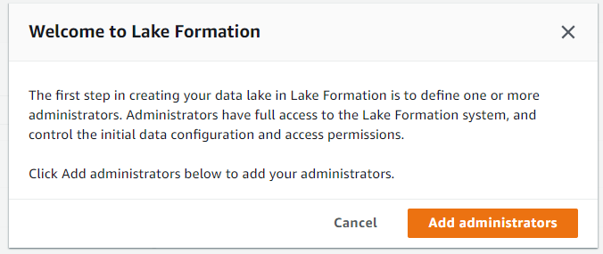
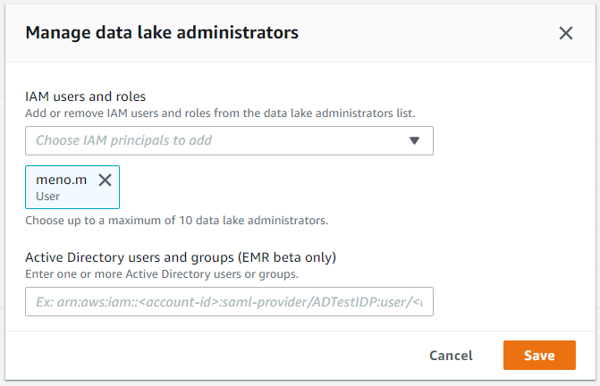
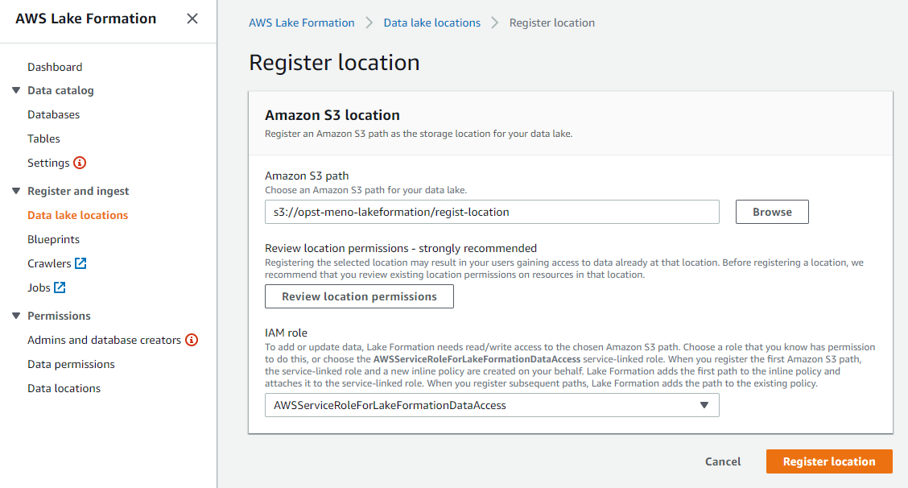
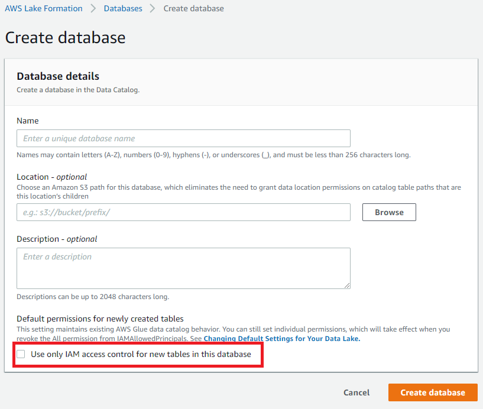
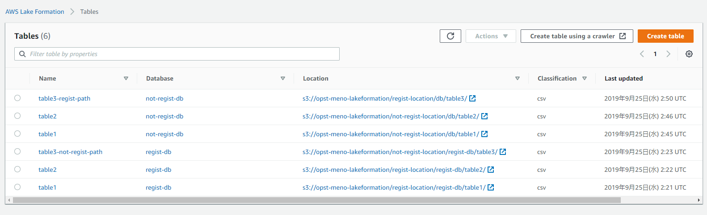
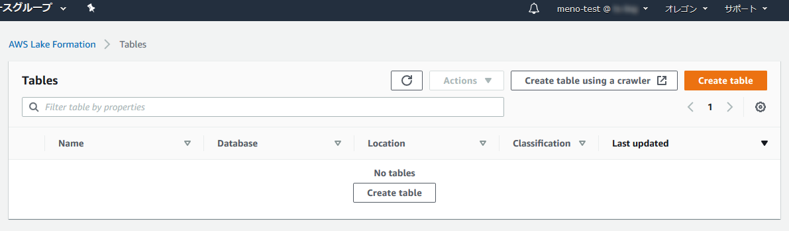

# ブログタイトル

2019年8月にAWS Lake Formationが一般公開となりました。
Lake Formationを利用することでデータレイクの構築やアクセス制御を統合管理できるようになりました。
この記事ではアクセス制御について紹介したいと思います。

# Lake Formation とは
公式では「安全なデータレイクを数日で簡単にセットアップできるサービス」と書かれています。数日触った感覚だとAWS Glue ＋ アクセス制御の管理機能といった印象になります。

## 機能一覧

- S3登録
  - データレイクとなるS3のパスを登録・削除できます。
  - 登録したS3パス配下をLakeFromationで管理することができるようになります。
- データカタログ管理
  - ＝ Glueの機能になります。Glue、LakeFormationどちらからでも管理できます
  - データカタログはGlueとLakeFormationで共有されています。
- Buleprints
  - 何種類かのテンプレートからWorkFlowを作成できます
  - WorkFlowとはETL処理をひとまとめにしたものです。
  - テンプレートから定期的にCloudTrailやRDBのデータをデータレイクに出力させるようなWorkFlowを作る事ができるようです。
- **アクセス制御**
  - データカタログへのアクセス権限をIAMユーザユーザ/ロールに対してGrant/Revokeさせることができます。
  - アクセス権限はデータベース単位からテーブルのカラム単位まで細かく制御できます。

# アクセス制御をためしてみる。
実際にLake Formationでアクセス権限を設定して、実際に制御されているかどうか確認してみたいと思います。

確認手順

1. LakeFormation管理者権限のIAMユーザでデータカタログを構築
   - LakeFormationに登録済みのS3パス、未登録S3パスそれぞれにデータを置き、登録済・未登録のパスのテーブルに対するアクセス制御の影響も確認してみます。
1. 管理者で一般ユーザに対して権限の許可設定を付与する。
1. 一般ユーザでLakeFromationまたはAthenaコンソールで許可設定が有効になっているかを確認する  

## 検証用環境構築

今回の検証用に以下の環境を構築しています。

### IAMユーザー

- meno.m
  - LakeFormation管理者。検証用DB、テーブルの作成者。
  - 付与ポリシー：Administrator
- meno-test
  - 一般ユーザ。このユーザに対して権限の許可を与えていき、アクセス制御の挙動を確認していきます。
  - 付与ポリシー：AmazonAthenaFullAccess、AWSGlueConsoleFullAccess、AmazonS3FullAccess

### LakeFormationに登録するS3パス
以下のパスをLakeFormationのデータレイクとして登録しています。

- s3://opst-meno-lakeformation/regist-location 

### 構築したデータカタログ

#### データベース
  - regist-db
    - DBのロケーションをLakeFormation登録済みのパスに設定
    - `s3://opst-meno-lakeformation/regist-location/regist-db`
  - not-regist-db
    - DBのロケーションをLakeFormation未登録のパスに設定
    - `s3://opst-meno-lakeformation/not-regist-location/db`
  
#### テーブル一覧

| データベース  | テーブル               | S3パス                                                             | LakeFormation   登録済パス |
| ------------- | ---------------------- | ------------------------------------------------------------------ | ----------------------------- |
| regist-db     | table1                 | s3://opst-meno-lakeformation/regist-location/regist-db/table1/     | ○                             |
| regist-db     | table2                 | s3://opst-meno-lakeformation/regist-location/regist-db/table2/     | ○                             |
| regist-db     | table3-not-regist-path | s3://opst-meno-lakeformation/not-regist-location/regist-db/table3/ |                               |
| not-regist-db | table1                 | s3://opst-meno-lakeformation/not-regist-location/db/table1/        |                               |
| not-regist-db | table2                 | s3://opst-meno-lakeformation/not-regist-location/db/table2/        |                               |
| not-regist-db | table3-regist-path     | s3://opst-meno-lakeformation/regist-location/db/table3/            | ○                             |

## Lake Formation初期設定

LakeFormationで上記データカタログを管理できるように設定していきます。

### LakeFormation管理者登録（LakeFormationコンソール初回アクセス時）

LakeFormationコンソールに初回アクセス時は、
LakeFormation管理者の登録が要求されるので、任意のIAMユーザまたはロールを選択してください（管理者は最大10ユーザまで）。

管理者権限をもつIAMであれば後から管理者の追加・変更可能です。

今回はIAMユーザ`meno.m`を管理者にしています。

### データレイク登録

コンソールからデータレイクとして利用するS3パスを登録します。

### データカタログ構築

LakeFormationコンソールからDBおよびテーブルを登録します。
このあたりのUIはGlueとほぼ同様なので、操作手順は割愛しますが、
1箇所だけ注意点があります。

DB作成時のUIでチェックボックス「`Use only IAM access control for new tables in this database`」があると思いますが、
こちらのチェックは外してDBを登録してください。

チェックした場合、Glue、Athenaにアクセス可能な全てのIAMユーザが
作成したDBに対してアクセスできる許可設定が自動的に設定されます。

この許可設定はLakeFormationコンソールの「Data permissions」ページから
確認できますので、チェック外し忘れた場合でも、後からその許可設定を取り消すことができます。

## 1. 初期状態の確認

まずは、管理者かつDB作成者`meno.m`と一般ユーザ`meno-test`のDB一覧ページを確認します。

当たり前ですが`meno.m`からは作成したDB、テーブル情報が全て確認できます。
`meno-test`からはDBへの権限が一つもない状態のため、一覧に表示されていません。

- `meno_m` テーブル一覧

- `meno-test` テーブル一覧

