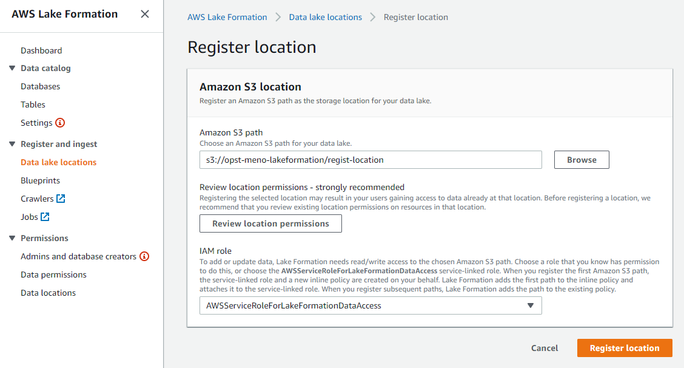
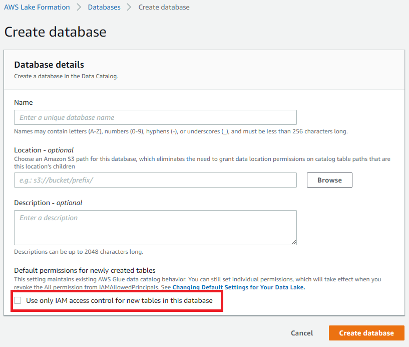

2019 年 8 月に AWS Lake Formation が一般公開となりました。
Lake Formation を利用することでデータレイクの構築やデータカタログの権限制御を統合管理できるようになりました。
この記事では LakeFormation の機能の一つである権限制御について紹介したいと思います。

# Lake Formation とは

公式では「安全なデータレイクを数日で簡単にセットアップできるサービス」と書かれています。数日触った感覚だと AWS Glue の拡張版といった印象になります。

## 機能一覧

- Datalake 登録
  - データレイクとなる S3 のパスを登録・削除できます。
  - 登録した S3 パス配下を LakeFromation で管理することができるようになります。
- データカタログ管理
  - Glue とほぼ等しい機能になります。Glue、LakeFormation どちらからでも管理できます
  - データカタログは Glue と LakeFormation で共有されています。
- Buleprints
  - 何種類かのテンプレートから WorkFlow を作成できます
  - WorkFlow とは ETL 処理をひとまとめにしたものです。
  - テンプレートから定期的に CloudTrail や RDB のデータをデータレイクに出力させるような WorkFlow を作る事ができるようです。
- **権限制御**
  - データカタログへのアクセス権限を IAM ユーザユーザ/ロールに対して Grant/Revoke させることができます。
  - アクセス権限はデータベース単位からテーブルのカラム単位まで細かく制御できます。

# 権限制御をためしてみる。

実際に Lake Formation でアクセス権限を設定して、実際に制御されているかどうか確認してみたいと思います。

確認手順

1. LakeFormation 管理者権限の IAM ユーザでデータカタログを構築
   - LakeFormation に登録済みの S3 パス、未登録 S3 パスそれぞれにデータを置き、登録済・未登録のパスのテーブルに対する権限制御の影響も確認してみます。
2. 管理者で一般ユーザに対して権限の許可設定を付与する。
3. 一般ユーザで LakeFromation または Athena コンソールで許可設定が有効になっているかを確認する

## 検証用環境構築

今回の検証用に以下の環境を構築しています。

### IAM ユーザー

- meno.m
  - LakeFormation 管理者。検証用 DB、テーブルの作成者。
  - 付与ポリシー：Administrator
- meno-test
  - 一般ユーザ。このユーザに対して権限の許可を与えていき、権限制御の挙動を確認していきます。
  - 付与ポリシー：AmazonAthenaFullAccess、AWSGlueConsoleFullAccess、AmazonS3FullAccess

### LakeFormation に登録する S3 パス

以下のパスを LakeFormation のデータレイクとして登録しています。

- s3://opst-meno-lakeformation/regist-location

### 構築したデータカタログ

#### データベース

- regist-db
  - DB のロケーションを LakeFormation 登録済みのパスに設定
  - `s3://opst-meno-lakeformation/regist-location/regist-db`
- not-regist-db
  - DB のロケーションを LakeFormation に登録しない
  - `s3://opst-meno-lakeformation/not-regist-location/db`

#### テーブル一覧

| データベース  | テーブル               | S3 パス                                                            | LakeFormation <br> 登録済パス |
| ------------- | ---------------------- | ------------------------------------------------------------------ | ----------------------------- |
| regist-db     | table1                 | s3://opst-meno-lakeformation/regist-location/regist-db/table1/     | ○                             |
| regist-db     | table2                 | s3://opst-meno-lakeformation/regist-location/regist-db/table2/     | ○                             |
| regist-db     | table3-not-regist-path | s3://opst-meno-lakeformation/not-regist-location/regist-db/table3/ |                               |
| not-regist-db | table1                 | s3://opst-meno-lakeformation/not-regist-location/db/table1/        |                               |
| not-regist-db | table2                 | s3://opst-meno-lakeformation/not-regist-location/db/table2/        |                               |
| not-regist-db | table3-regist-path     | s3://opst-meno-lakeformation/regist-location/db/table3/            | ○                             |

テーブルデータはすべて以下の csv ファイルを使用しています。

```
"カラム1","カラム2",
"column1","column2"
```

## Lake Formation 初期設定

LakeFormation で上記データカタログを管理できるように設定していきます。

### LakeFormation 管理者登録（LakeFormation コンソール初回アクセス時）

LakeFormation コンソールに初回アクセス時は、
LakeFormation 管理者の登録が要求されるので、任意の IAM ユーザまたはロールを選択してください（管理者は最大 10 ユーザまで）。

管理者権限をもつ IAM であれば後から管理者の追加・変更可能です。

今回は IAM ユーザ`meno.m`を管理者にしています。


### データレイク登録

コンソールからデータレイクとして利用する S3 パスを登録します。



### データカタログ構築

LakeFormation コンソールから DB およびテーブルを登録します。
このあたりの UI は Glue とほぼ同様なので、操作手順は割愛しますが、
1 箇所だけ注意点があります。

DB 作成時の UI でチェックボックス「`Use only IAM access control for new tables in this database`」があると思いますが、
こちらのチェックは外して DB を登録してください。

チェックした場合、Glue、Athena にアクセス可能な全ての IAM ユーザが
作成した DB に対してアクセスできる許可設定が自動的に設定されます。

この許可設定は LakeFormation コンソールの「Data permissions」ページから
確認できますので、チェック外し忘れた場合でも、後からその許可設定を取り消すことができます。



## 1. 初期状態の確認

まずは、管理者かつ DB 作成者`meno.m`と一般ユーザ`meno-test`の DB 一覧ページを確認します。

当たり前ですが`meno.m`からは作成した DB、テーブル情報が全て確認できます。
`meno-test`からは DB への権限が一つもない状態のため、一覧に表示されていません。

- `meno.m` テーブル一覧
  

- `meno-test` テーブル一覧
  

`meno-test`には DB・テーブルの権限が一つもないためクエリ実行でも画像のようにパーミッションエラーとなります


## 2. Database の Permission 設定

まずは、DB「`regist-db`」の権限を`meno-test`に付与してみます。
LakeFormation の DB 一覧画面から`regist-db`をチェックし、右上のメニューから「Grant」を選択します。


許可設定画面が表示されますので、`meno-test`に対して`regist-db`のテーブル作成(Create table)の許可を設定します。


### 権限確認

設定後、`meno-test`ユーザで DB 一覧画面を更新すると、`regist-db`が一覧に表示されるようになりました。


しかし`regist-db`のテーブルに対する権限はまだ無いため、テーブル一覧画面では何も表示されていません。


## 3.Table の Permmision 設定

Table を参照するためには DB だけではなく Table に対する許可設定を行う必要があります。

`meno.m`ユーザで Table「table1」を選び、右上の Action メニューから「Grant」を選択します。


`meno-test`ユーザに対して「Select」の許可設定を付与します。


### 権限確認

`meno-test`で「not-regist-db」のテーブル一覧を確認すると「table1」テーブルのみ表示されるようになりました。


また、Athena で「table1」に対して Select クエリを実行すると正常にクエリが成功するようになりました。


## 4.カラム単位の Permission 設定

LakeFormation ではさらにテーブルのカラム単位での権限制御が可能です。
コンソールから`not-regist-db.table2`に対してカラム`col2`の Select のみ許可する設定をします。


この状態で Athena でクエリを実行するとクエリ結果は`col2`のみ表示される状態になります。
また、画像では確認できませんが、再度ペインのテーブル一覧にも許可されたカラムしか表示されないようになります。


## 5.`meno-test` Permission 一覧

`meno-test`に対してこれまでの作業で付与された Permission は以下の通りです。


## 6.Datalake 未登録パスへの権限制御について

これまでは DB、テーブルに対する権限について確認してきました。
ここからはデータレイクに登録した S3 パス、登録していないパスのデータに対する権限制御の違いにつてい確認したいと思います。

### 前提

- `meno-test`の LakeFormation の権限は`5.meno-test Permission 一覧`の状態とすします。
- `meno-test`のポリシーから S3 の権限をすべてデタッチします。

### Table 許可あり、Datalake 登録済 S3 パス内データへのクエリ

`regist-db.table1`は Datalake に登録済みの S3 パスにデータが保存されています。
また、LakeFormation の Pemmision 設定では`table1`の参照権限が付与されています。

このテーブルに対してクエリ実行すると従来であれば S3 権限が無いためクエリに失敗しますが、
Datalake に登録済みの場合はクエリ実行に成功します。

これは Datalake に登録したパスにアクセスする場合、LakeFormation 側で一時的にデータカタログの操作に必要な権限を付与してくれる仕様のためです。


### Table 許可あり、Datalake 未登録パス内データへのクエリ

`not-regist-db.table2`は Datalake として登録していない S3 パスにデータが保存されています。
また、LakeFormation の Pemmision 設定では`table2.col2`の参照権限が付与されています。

先程はクエリ実行に成功しましたが、S3 権限ポリシーがない状態でクエリ実行すると`Access Denied`となります。

DataLake 未登録のデータを参照する際は LakeFormation の Permission があった場合でも、
LakeFormation 側で権限が付与されず、IAM のポリシー権限に依存するようになります。


# まとめ

- IAM ポリシーとは別にデータカタログへのアクセス権限を制御可能
  - DB、テーブル、カラム単位で制御可能
  - 権限のない DB・テーブルは一覧に表示されなくなる
- Datalake 登録について
  - Datalake に登録した S3 パスへアクセスする場合、アクセスに必要な権限は自動的に付与される
  - 未登録のパスへのアクセス時は IAN のポリシーに依存する

これまではポリシーを駆使して実現してた権限制御が、LakeFormation を使うことで
より簡単、より細かく制御できるようになりました。また Datalake に登録していれば、
AWS の権限もよしなに付与してくれるので非常に便利ですね。
ぜひ皆さんも機会があれば利用してみてください。
